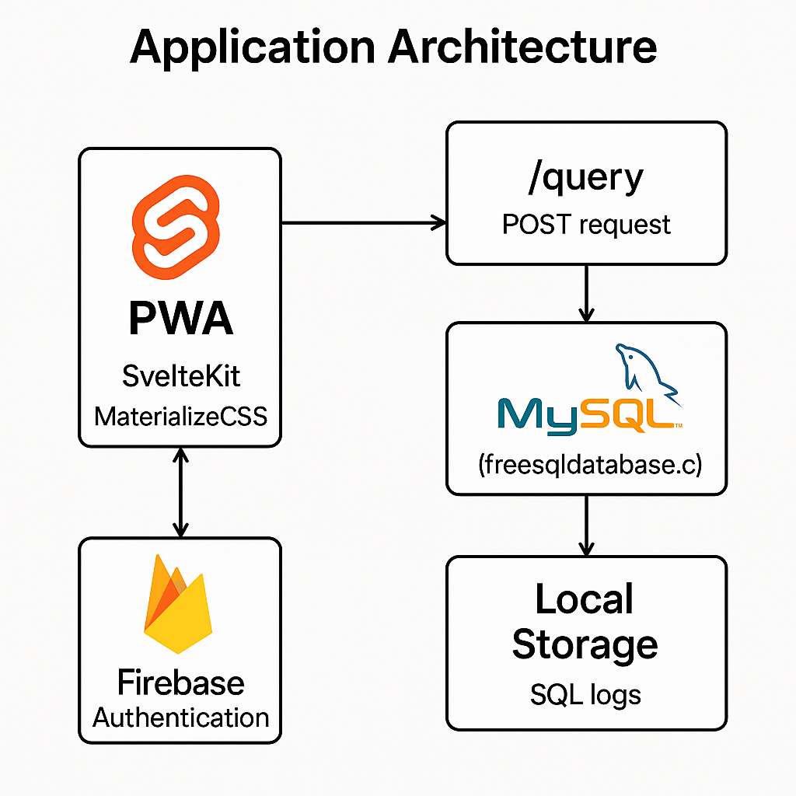
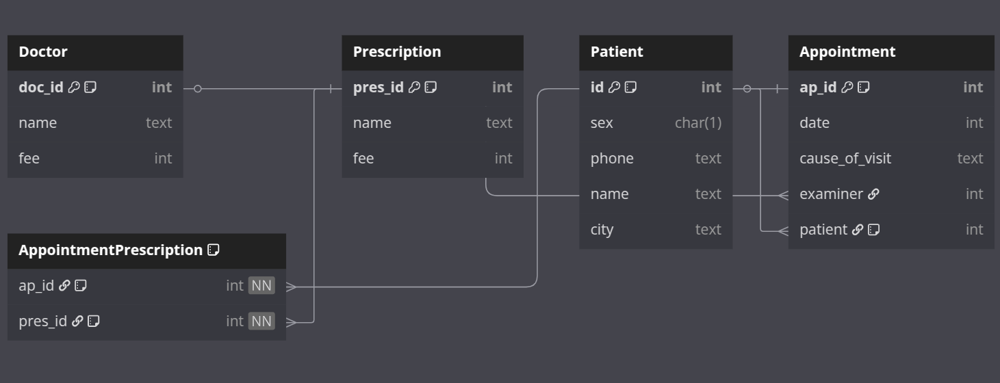
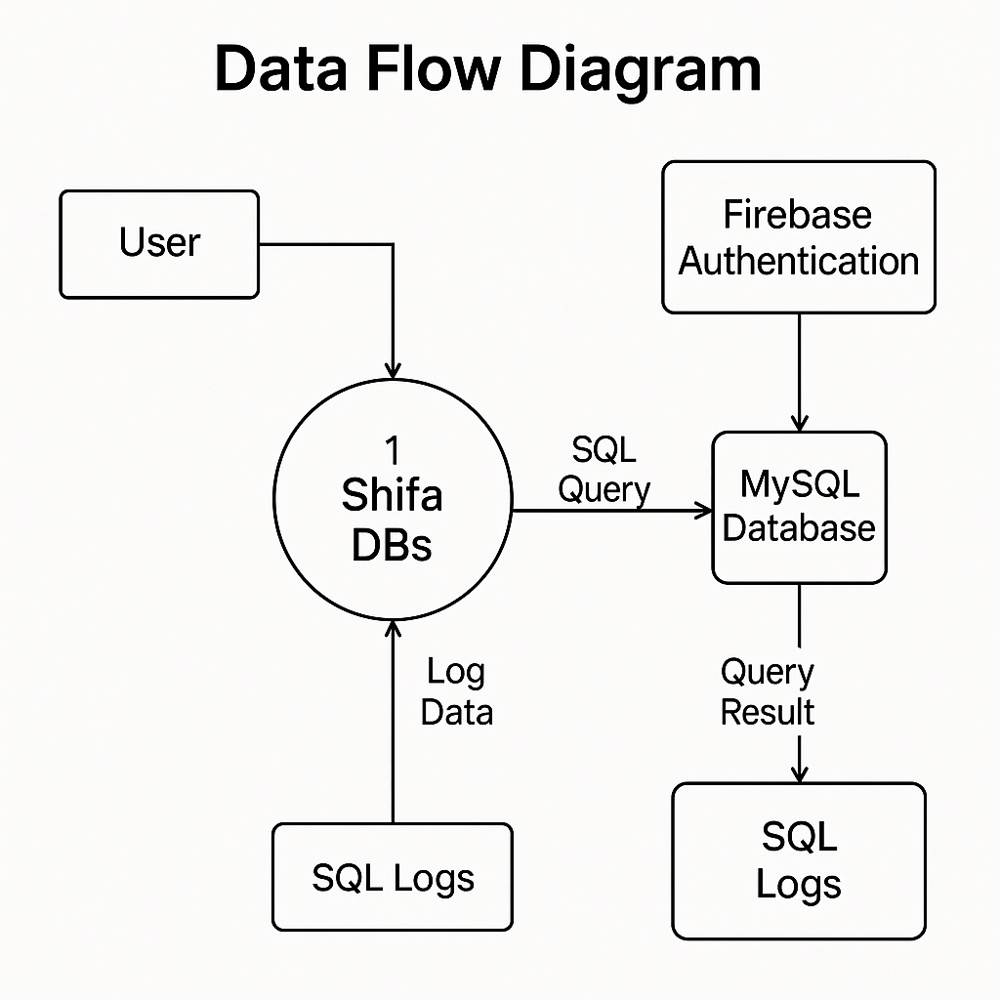

# 🏥 Shifa EHR – Electronic Health Records PWA

**Shifa DBs** is a semester-final project for the *Database Systems* course — a fully functional **Progressive Web App (PWA)** designed to manage Electronic Health Records (EHR).  
Built using **SvelteKit** and styled with **MaterializeCSS**, it connects to a **MySQL** database hosted on _freesqldatabase.com_.

🔐 Secure login is handled via **Firebase Authentication**. The app enables you to:
- Add/remove 🧍‍♂️ **patients**
- Manage 👨‍⚕️ **doctors**
- Write 💊 **prescriptions**
- Book 📅 **appointments**
- View **real-time SQL logs** 🐘 for full backend transparency — perfect for learning and demonstration!

---

### 👨‍💻 Project Details

- **Developers:** Abdullah Zafar *(L1F23BSAI0054)* & Abdurrehman *(L1F23BSAI0050)*  
- **Course Instructor:** Mam Maida Sajid

---

## 🔑 Test Login Credentials

🌐 [**Try it Live**](https://shifa-dbs.vercel.app)

- **Email:** `test@shifa.com`  
- **Password:** `behankbhai123`  

> *Test mode only — use responsibly!* 🧪

---

## 🧭 App Architecture Diagram  


---

## 🔄 Entity-Relationship (ER) Model  


---

## 🔄 Data Flow Diagram  


---

# ⚙️ Development & Setup

## 📁 1) Clone and Install Dependencies

```bash
# Clone the repository
git clone https://github.com/raz0229/shifa-dbs.git

# Navigate into the project
cd shifa-dbs

# Install dependencies
npm install
```

---

## 🧪 2) Setup Environment Variables

Create a `.env` file in the root directory with the following keys:  
*(This uses a remote MySQL database from freesqldatabase.com)*

```env
DATABASE_HOST=
DATABASE_USER=
DATABASE_PASSWORD=
DATABASE_NAME=
DATABASE_PORT=3306
SETUP_PASSWORD=my_own_secret
```

> ⚠️ **Do NOT** prefix any variable with `PUBLIC_`.

---

## 🧰 3) First-Time Setup *(Optional)*

To insert dummy data and initialize your schema for demonstration, first run the dev server:

```bash
npm run dev
```

Then, send a `POST` request to `/firstTimeSetup` from your browser’s **DevTools Console**:

```js
fetch('http://localhost:5173/firstTimeSetup', {
  method: 'POST',
  headers: {
    'Content-Type': 'application/json'
  },
  body: JSON.stringify({
    password: 'my_own_secret'
  })
})
.then(response => response.json())
.then(data => console.log('✅ Success:', data))
.catch(error => console.error('❌ Error:', error));
```

> 🔐 **Note:** Due to CORS, use the DevTools console from inside the running app — external POST requests will be blocked by SvelteKit.

---

## 🚀 4) Build & Deploy

To build the app for production:

```bash
npm run build
```

> 🛠️ Use the `adapter-vercel` package for deploying to **Vercel**.  
> ⚠️ App builds only on **Node < 16.x** — ensure compatibility!

---
